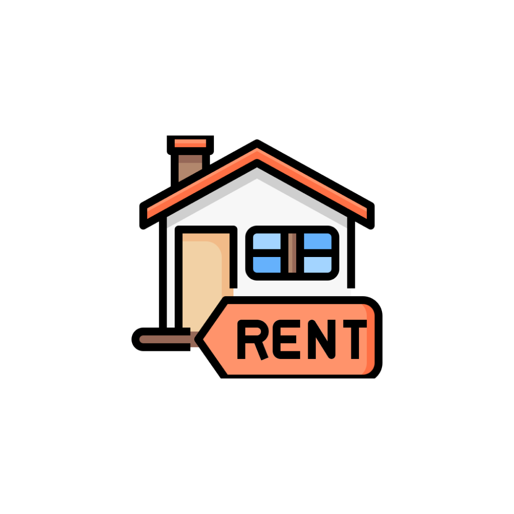
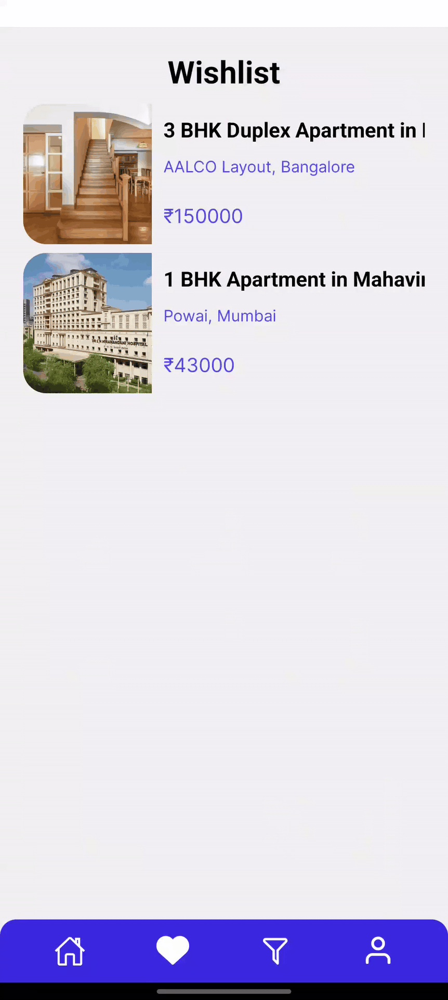

# Rentify

<p>
  
</p>

Built on the robust foundation of React Native, Firebase, and Redux, Rentify stands as a user-friendly property rental application. This innovative platform empowers users to effortlessly explore an extensive range of property listings, providing detailed insights into each property's location, amenities, rental prices, and insider photos. Users can seamlessly connect with property owners and optimize their property search through effective filters based on criteria such as location, price range, number of bedrooms, and property type. Rentify offers a streamlined and enriched user experience, making property exploration and rental decisions more convenient.

## Installation

You can download the Rentify app from the following link: [Rentify.apk](https://github.com/rohanudhwani/Rentify/raw/master/Rentify.apk)

## App Features

- **Browse Listings:** Users can easily browse through a diverse range of property listings.
- **Detailed Information:** Each listing provides detailed information, including location, amenities, rental terms, and contact details.
- **Property View:** The app includes a dedicated viewing page, allowing users to get a closer look at the property before making rental decisions.
- **Filter Properties:** The filter page is an essential tool for refining property searches based on specific criteria, enhancing user experience by saving time and effort.
- **Location Map:** The location page displays property listings on a map, making it easy for users to identify the approximate location of each property.


## GIF Previews

### Table 1: Features Showcase

|  |  |  |
| -------------------------------------------------------- | -------------------------------------------------- | ------------------------------ |
| **Filter and Wishlist:** Showcase of filter and wishlist functionalities. | **Home and Detail:** Interaction on the home page and property detail page. | **Property:** Displaying property listings and detailed information. |

### Table 2: User Interaction

|  |  |  |  |
| -------------------------- | ------------------------ | ---------------------- | ----------------------------- |
| **Search:** Interaction with the property search feature. | **SignUp:** Walkthrough of the user registration process. | **User:** User profile view and sign-out option. | **Location:** Interaction with the location page and map. |


## Screens

- **Home:** The main page where users can view and click on listings to access more detailed information.
- **Detail:** A detailed page describing the key features, amenities, and contact details of a specific property.
- **View:** A dedicated page for a closer look at the property, aiding users in making informed decisions.
- **Filter:** An essential tool for refining property searches based on specific criteria.
- **Location:** Displays property listings on a map for easy identification of approximate locations.
- **OnBoarding:** Introduction and onboarding screens for new users.
- **SignUp:** User registration page.
- **User:** User profile page with details and a sign-out option.
- **Wishlist:** Page for managing and viewing user-selected properties.

## Getting Started

Ensure you have Expo installed:
```bash
npm install -g expo-cli
```

Navigate to the Threads project directory:
```bash
cd Rentify
```

Install dependencies:
```bash
npm install
```

Run the app:
```bash
npx expo start
```

## UI Inspiration

The UI design of Rentify is inspired by a Behance project, available at [Behance Rental App UI Design](https://www.behance.net/gallery/185017713/Rental-App-Ui-Design).


Feel free to explore the Rentify app, and we hope it enhances your property rental experience!
